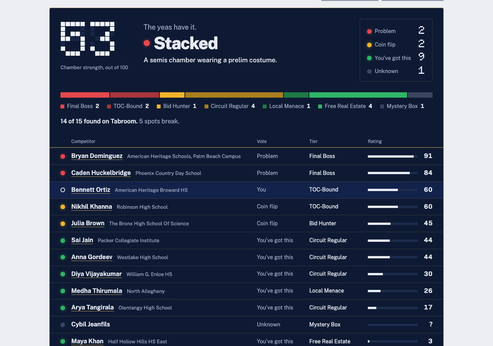

# Is My Chamber Stacked?

Paste your Congressional Debate chamber from Tabroom and see how strong the room is, how fried you are, and who to watch.

**Live site: https://ismychamberstacked.github.io/**



## What it does

- **Rates a chamber.** Paste the schematic (judges and room numbers are skipped), fix any misread names, and get a chamber strength, a verdict, and a ranked roster of everyone in the room.
- **Tells you how fried you are.** Mark yourself and a 5,000-run simulation of the round gives your break odds and average finish. Reports can be shared as a link or printed.
- **Looks anyone up.** Every competitor has a profile with a results timeline, and there are season and all-time rankings.

## How the rating works

Each result on Tabroom earns points by the tournament's level, how far the competitor got, and how big the field was. Recent results count more. A person's rating is their best results blended on a 0-100 curve, with floors for bids and TOC finals. A chamber's strength is 75% the average of the players who would break plus 25% the average of everyone else. The cutoffs for "Stacked" and the other labels come from 173 real 2025-26 national-circuit prelim chambers. The full formula, with worked examples, is on the [How it works](https://ismychamberstacked.github.io/#/about) page.

## Data pipeline

A single stdlib-only script, `app.py`, does everything, and GitHub Actions runs it every Monday and on each push:

1. `--crawl` fetches the current season's Tabroom results into `cache/`.
2. `--freeze` writes finished seasons to `perfs/*.json.gz`, which are committed so the history never needs re-crawling.
3. `--export site` builds `site/` (static JSON shards by name hash, rankings, calibration) and copies `index.html` and `assets/`.
4. Tests run against the built site, then it deploys to GitHub Pages. A failing test blocks the deploy.

To remove someone who asks (the About page links to a GitHub issue for this), add their name to `optout.txt`, one per line. The next export leaves them out of every page.

## Run locally

```
python3 app.py --export site
python3 -m http.server -d site 8000
```

Open http://localhost:8000. Python 3 standard library only (CI runs 3.13). `python3 app.py --selfcheck` checks the scoring and export code.

## Tests

The browser tests need a built `site/`:

```
pip install pytest playwright
playwright install chromium
python3 -m pytest -q
```

They check every route for console errors and sideways scrolling at 375 px, the sample and pasted-chamber flows, share-link round trips, lookup, rankings and the About histogram.

## Credits

Built by Charles Alexander. Results come from public Tabroom pages. Not affiliated with Tabroom or the NSDA.
